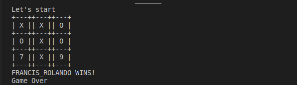
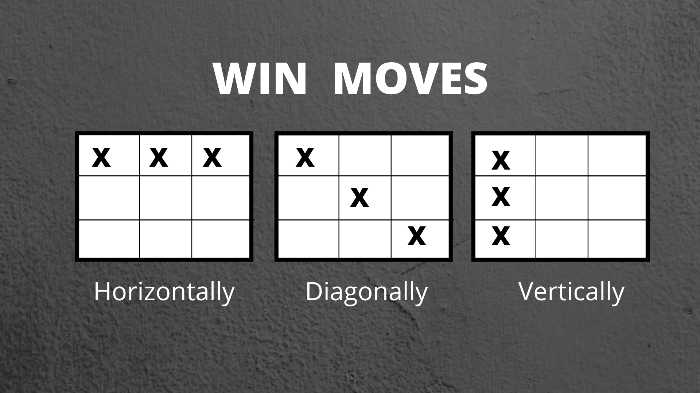
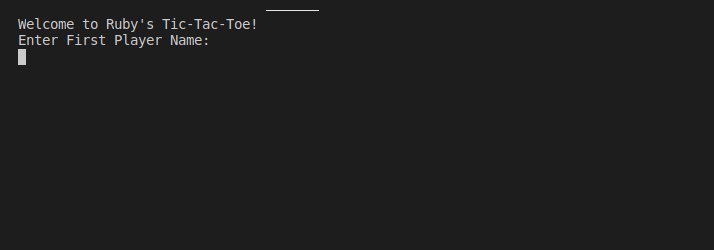

# Object Oriented Programming (OOP)

> Building a Ruby game of TicTacToe following OOP methodologies

This is a colloborative project to build a game of TicTacToe puting into practice
the concepts of Object Oriented Programming (OOP). We have demonstrated the use of
classes in Ruby and how to access their properties and methods. Here is a brief description
of TicTacToe.

TicTacToe - "a game in which two players seek in alternate turns to complete a row,
a column, or a diagonal with either three O's or three X's drawn in the spaces
of a grid of nine squares" (Oxford Dictionary).

## Game Rules

1. Player Wins Game when they place 3 marks (`X` or `O`) in a row either horizontally,
   vertically or diagonally. 
2. Draw Game, when no 3 consecutive marks and no available cell.
3. Player 1 starts the game with `X`

## How to Play

1. Enter Player 1 name
2. Enter Player 2 name
3. Player 1 selects available cell
4. Player 2 takes turn and selects available cell
5. Repeat steps 3 & 4 until round complete

## Live Demo

## Getting Started

To get a local copy up and running follow these simple example steps.

1. Open terminal or command line
2. Run the following commands
   $ `git clone https://github.com/francisuloko/tic-tac-toe.git`
   $ `cd tic-tac-toe/bin/`
   $ `./main.rb` OR `ruby main.rb`

## Built With

- Ruby

### Prerequisites
1. Terminal or command line
2. Latest version of Ruby

## Authors

👤 **Author1**

- GitHub: [@FrancisUloko](https://github.com/francisuloko)
- Twitter: [@FrancisUloko](https://twitter.com/FrancisUloko)
- LinkedIn: [Francis Uloko](https://linkedin.com/in/francisuloko)

👤 **Author2**

- GitHub: [@Rolando](https://github.com/kiranitor123)
- Twitter: [@rolando](https://twitter.com/FayeRolando)
- LinkedIn: [Rolando](https://www.linkedin.com/in/rolando-diego-alvarez-faye-b2b34a1a9/)

## 🤝 Contributing

Contributions, issues, and feature requests are welcome!

Feel free to check the [issues page](https://github.com/francisuloko/tic-tac-toe/issues).

## Show your support

Give a ⭐️ if you like this project!

## Acknowledgments

- Microverse Inc.
- The Odin Project

## 📝 License

This project is [MIT](https://mit-license.org) licensed.
